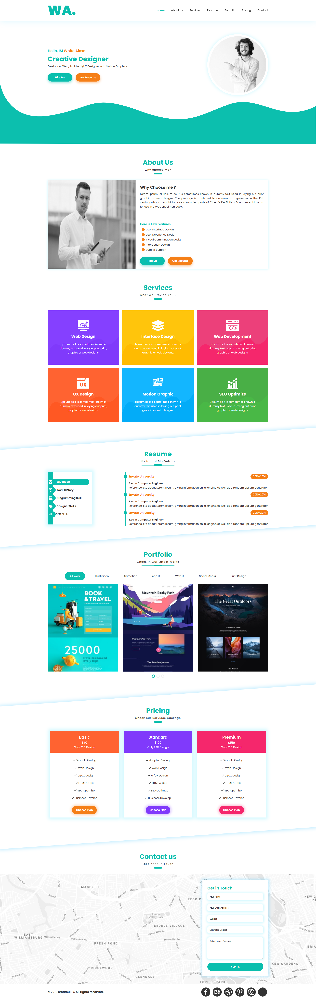
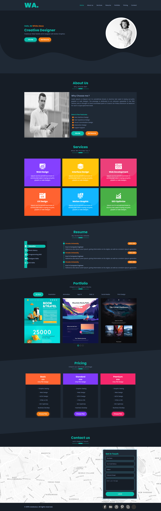

## 💻 Personal Landing Page

A modern, responsive landing page designed to showcase personal skills and projects. Built with HTML, CSS, and JavaScript.

### 🚀 Demo
<a href="https://alimohammadi00.github.io/WA-Personal-web/">Live Demo</a>

### 📸 Preview

Light Mode 👇  

Dark Mode 👇  

### 📁 Features

- Fully responsive for mobile and desktop devices
- Dedicated resume section with categorized information
- Portfolio section showcasing apps and projects
- Clean and simple contact area
- Light/Dark mode toggle

### 🛠️ Built With

- HTML5
- CSS3
- JavaScript
- Swiper.js

### 🙌 Author

Made with ❤️ by **Ali Mohammadi**  
[GitHub Profile](https://github.com/alimohammadi00)

### 📜 License

This project is licensed under the [MIT License](LICENSE).
